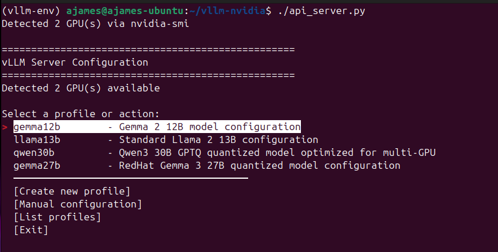

# vLLM NVIDIA Server

A Python wrapper around vLLM for running LLM inference on NVIDIA GPUs. Includes an interactive menu for selecting models, automatic GPU detection, and YAML-based configuration profiles.

Currently set up for Ubuntu (tested on 24.04).

## Features

- Interactive menu for model selection and configuration
- Automatic GPU count detection and tensor parallelism setup
- YAML configuration profiles for common models (Qwen, Gemma, LLaMA)
- Interactive setup for creating custom model configurations
- **vRAM requirement estimation** - predict memory usage before downloading models
- Full CLI support with all vLLM parameters
- OpenAI-compatible API server

## Quick Start

1. **Run the setup script:**
   ```bash
   ./setup.sh
   ```

2. **Activate the environment:**
   ```bash
   source activate_vllm.sh
   ```

3. **Check GPU configuration:**
   ```bash
   python multi_gpu_config.py
   ```

4. **Estimate vRAM requirements:**
   ```bash
   python estimate_vram.py
   ```

5. **Test basic inference:**
   ```bash
   python basic_inference.py
   ```

6. **Start API server:**

   **Interactive Menu**
   ```bash
   python api_server.py
   ```

   

   The menu provides:
   - Profile selection with automatic GPU detection
   - Interactive profile creation
   - One-time manual configuration
   - Profile listing and management

   **Command Line Interface**
   ```bash
   # List available profiles
   python api_server.py --list-profiles

   # Use a profile
   python api_server.py --profile qwen3-30b-a3b-gptq-int4
   python api_server.py --profile redhat-gemma-3-27b-it-quantized-w4a16

   # Override profile settings
   python api_server.py --profile redhat-gemma-3-27b-it-quantized-w4a16 --port 8080 --max-model-len 8192

   # Force specific GPU count
   python api_server.py --profile qwen3-30b-a3b-gptq-int4 --tensor-parallel-size 1

   # Manual configuration with auto GPU detection
   python api_server.py \
     --model "meta-llama/Llama-2-13b-hf" \
     --tensor-parallel-size auto \
     --gpu-memory-utilization 0.9 \
     --max-model-len 4096 \
     --dtype float16

   # Use custom profile file
   python api_server.py --profile ~/my-profiles/custom.yaml

   # Show all options
   python api_server.py --help
   ```

7. **Monitor GPU usage:**
   ```bash
   python monitor_gpus.py
   ```

## Environment Reactivation

To reactivate the environment from anywhere:
```bash
source /path/to/vllm-nvidia/activate_vllm.sh
```

## API Usage

The server is OpenAI-compatible. Start with:
```bash
# Interactive menu
python api_server.py

# Or directly with a profile
python api_server.py --profile qwen3-30b-a3b-gptq-int4
```

Then test with curl:
```bash
curl -X POST "http://localhost:8000/v1/chat/completions" \
     -H "Content-Type: application/json" \
     -d '{
       "model": "RedHatAI/gemma-3-27b-it-quantized.w4a16",
       "messages": [{"role": "user", "content": "Hello, how are you?"}],
       "max_tokens": 100
     }'
```

## Custom Profiles

Create your own model profiles in `profiles/` directory as YAML files:

```yaml
name: my_model
description: My custom model configuration
model: path/to/model
tensor_parallel_size: auto  # or use a number like 2
gpu_memory_utilization: 0.95
max_model_len: 16384
dtype: bfloat16
```

See `profiles/README.md` for detailed documentation.

## vRAM Estimation Tool

The included `estimate_vram.py` tool helps predict memory requirements before downloading models:

```bash
# Analyze all model profiles
python estimate_vram.py

# Show memory requirements per GPU instead of total
python estimate_vram.py --per-gpu

# Get optimization suggestions for models that don't fit
python estimate_vram.py --suggest

# Analyze a specific profile
python estimate_vram.py --profile qwen3-30b-a3b-gptq-int4

# Show verbose breakdown
python estimate_vram.py --verbose
```

The tool:
- Fetches actual model sizes from HuggingFace API
- Estimates KV cache and activation memory
- Shows which models will fit in your available vRAM
- Explains why some models fail to download
- Provides optimization suggestions

## Troubleshooting

1. **Out of Memory**: Reduce `gpu_memory_utilization` or `max_model_len`
2. **Slow Loading**: Ensure models are cached in `~/.cache/huggingface/`
3. **CUDA Errors**: Check `nvidia-smi` and restart if needed
