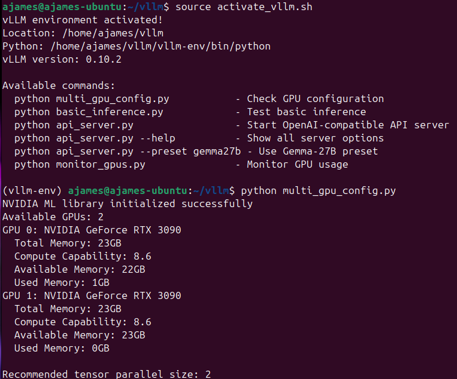

# vLLM NVIDIA - Usage Instructions



## Quick Start

1. **Run initial setup (first time only):**
   ```bash
   ./setup.sh  # Run as normal user, will prompt for sudo password when needed
   ```

2. **Activate the environment:**
   ```bash
   source activate_vllm.sh
   ```

3. **Check GPU configuration:**
   ```bash
   python multi_gpu_config.py
   ```

4. **Test basic inference:**
   ```bash
   python basic_inference.py
   ```

5. **Start API server:**
   ```bash
   # Default configuration (Gemma-27B)
   python api_server.py

   # Use preset configurations
   python api_server.py --preset gemma27b  # RedHat Gemma-27B quantized
   python api_server.py --preset gemma12b  # Google Gemma-12B
   python api_server.py --preset llama13b  # Meta Llama-13B

   # Custom configuration
   python api_server.py --model "your-model" --port 8080 --tensor-parallel-size 2

   # Show all options
   python api_server.py --help
   ```

6. **Monitor GPU usage:**
   ```bash
   python monitor_gpus.py
   ```

## Environment Location

This installation is located at: `~/vllm-nvidia/`

To reactivate from anywhere:
```bash
source ~/vllm-nvidia/activate_vllm.sh
```

## API Configuration

### Quick Configuration via Command Line
```bash
# Custom model and settings
python api_server.py \
  --model "your-model-name" \
  --max-model-len 8192 \
  --tensor-parallel-size 2 \
  --gpu-memory-utilization 0.9 \
  --port 8080
```

### Modifying Default Settings in api_server.py

Edit the `DEFAULT_CONFIG` dictionary at line 13 in `api_server.py`:

```python
DEFAULT_CONFIG = {
    "model": "RedHatAI/gemma-3-27b-it-quantized.w4a16",  # Change model here
    "tensor_parallel_size": 2,        # Number of GPUs to use
    "gpu_memory_utilization": 0.85,   # GPU memory (0.0-1.0)
    "max_model_len": 16384,           # Maximum context length
    "dtype": "bfloat16",              # Data type (float16/bfloat16/float32)
    "port": 8000,                     # API server port
    "host": "0.0.0.0",                # API server host
    "max_num_batched_tokens": 32768   # Max batch size
}
```

### Key Parameters

- **model**: HuggingFace model ID or local path
- **max_model_len**: Maximum context window (reduce if OOM errors)
- **tensor_parallel_size**: Number of GPUs to split model across
- **gpu_memory_utilization**: Fraction of GPU memory to use (0.0-1.0)
- **dtype**: Model precision (bfloat16 recommended for newer GPUs)

## API Usage

The server is OpenAI-compatible. Start with:
```bash
python api_server.py
```

Then test with curl:
```bash
curl -X POST "http://localhost:8000/v1/chat/completions" \
     -H "Content-Type: application/json" \
     -d '{
       "model": "RedHatAI/gemma-3-27b-it-quantized.w4a16",
       "messages": [{"role": "user", "content": "Hello, how are you?"}],
       "max_tokens": 100
     }'
```

## Troubleshooting

1. **Out of Memory**: Reduce `gpu_memory_utilization` or `max_model_len`
2. **Slow Loading**: Ensure models are cached in `~/.cache/huggingface/`
3. **CUDA Errors**: Check `nvidia-smi` and restart if needed
